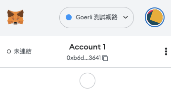
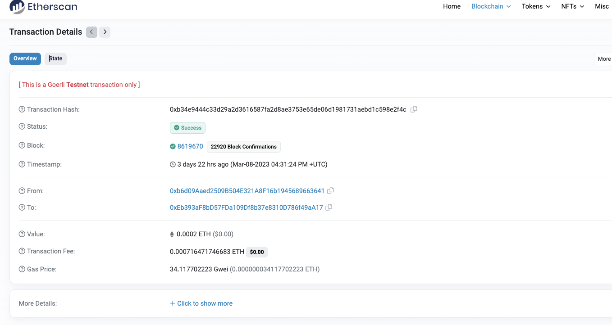

# 1. 01-metamask

# 2. test hash
[https://goerli.etherscan.io/tx/0xb34e9444c33d29a2d3616587fa2d8ae3753e65de06d1981731aebd1c598e2f4c](https://goerli.etherscan.io/tx/0xb34e9444c33d29a2d3616587fa2d8ae3753e65de06d1981731aebd1c598e2f4c)

# 3. test screen shot

# 4. counter
Counter.sol

Deployment
[https://goerli.etherscan.io/address/0x756658c3BE1f718d451c937592BBC5895dFCec02#code](https://goerli.etherscan.io/address/0x756658c3BE1f718d451c937592BBC5895dFCec02#code)