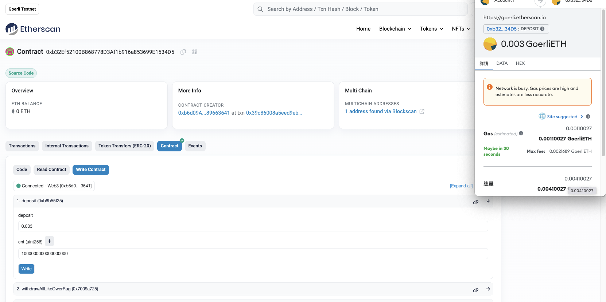
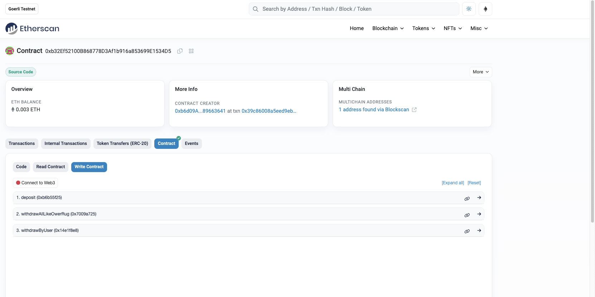
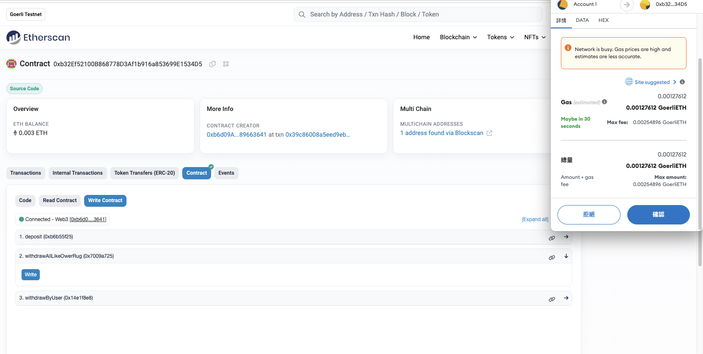

# 1. contract address
0xb32Ef52100B868778D3Af1b916a853699E1534D5
[https://goerli.etherscan.io/address/0xb32Ef52100B868778D3Af1b916a853699E1534D5](https://goerli.etherscan.io/address/0xb32Ef52100B868778D3Af1b916a853699E1534D5)

<br/><br/>

# 2. test result
## (1) deposit

## (2) check_contract_value

## (3) withdraw_all


# Sample Hardhat Project

This project demonstrates a basic Hardhat use case. It comes with a sample contract, a test for that contract, and a script that deploys that contract.

Try running some of the following tasks:

```shell
npx hardhat help
npx hardhat test
REPORT_GAS=true npx hardhat test
npx hardhat node
npx hardhat run scripts/deploy.js
```
npx hardhat run scripts/deploy.js --network goerli
npx hardhat verify ${address} --network goerli