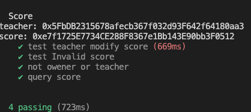

# HW Topic
编写合约Score，⽤于记录学⽣（地址）分数:

1. 仅有⽼师（⽤modifier权限控制）可以添加和修改学⽣分数
2. 分数不可以⼤于 100
3. 编写合约 Teacher 作为⽼师，通过 IScore 接⼝调⽤修改学⽣分数。


# Steps
1. npx hardhat test
2. view result


# Sample Hardhat Project

This project demonstrates a basic Hardhat use case. It comes with a sample contract, a test for that contract, and a script that deploys that contract.

Try running some of the following tasks:

```shell
npx hardhat help
npx hardhat test
REPORT_GAS=true npx hardhat test
npx hardhat node
npx hardhat run scripts/deploy.js
```
